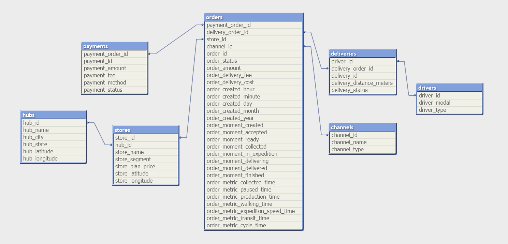

# Projeto de Engenharia de Dados - Delivery Center 🚚

[](https://www.docker.com/)
[](https://www.postgresql.org/)
[](https://www.pgadmin.org/)

<p align="center">
  
</p>

Este projeto é um complemento de outro projeto: [análise de dados do Delivery Center](https://github.com/sch-paulo/delivery_center_data_analysis/), e consiste no empacotamento do processo de ETL com PostgreSQL e pgAdmin4 utilizando Docker, para torná-lo facilmente executável em qualquer ambiente. 

## Funcionalidades

- **Serviços containerizados**:
  - Banco de dados PostgreSQL
  - Pipeline ETL em Python
  - Interface web via pgAdmin4
- **Relatórios analíticos pré-construídos** (10 *queries* SQL)
- **Estruturação do Schema** (`schema/schema.sql`)
- Conjuntos de dados de exemplo inclusos (`dataset/`)

## Estrutura

```bash
.
├── dataset/               # Arquivos CSV do dataset de origem
├── reports/               # Consultas SQL
├── schema/                # Definição do schema do banco
├── docker-compose.yaml    # Orquestração de containers
├── Dockerfile             # Definição do serviço ETL
├── etl.py                 # Script de processamento de dados
└── README.md              # Documentação do projeto
```

## Pré-requisitos

- Docker Desktop instalado ([Windows/Mac](https://www.docker.com/products/docker-desktop) | [Linux](https://docs.docker.com/engine/install/))

- 4GB+ de RAM alocada para o Docker

- Mínimo de 3GB de espaço em disco

## Como rodar
### 1. Clonar o Repositório
```bash
git clone https://github.com/sch-paulo/delivery_center_container.git
cd delivery_center_container
```

### 2. Iniciar os Containers
```bash
docker-compose up --build
```

#### Observação para primeira execução:

- A configuração inicial pode levar alguns minutos

- Os logs de cada serviço mostrarão a situação da execução

- O processo ETL inicia automaticamente após o *health check* do banco

### 3. Acessar o pgAdmin
| Ação   |  Credenciais                        |
|-----------------------------|------------------------------------|
| **Acessar `http://localhost:5050`** | **Email:** `admin@admin.com` <br> **Senha:** `admin` |
| **Clicar em *Add New Server***   | - | 
| **Aba *General***   | Name: `delivery_center` (ou qualquer outro da sua preferência) | 
| **Aba *Connection***   | **Host name/address:**  `db` <br> **Port:** `5432`<br> **Maintenance database:** `delivery_center` <br> **Username:** `postgres` <br> **Password:** `postgrespass`

## Modelo de dados
Os dados utilizados estão distribuídos em sete tabelas, com informações sobre canais de venda, entregas, entregadores, hubs, pedidos, pagamentos e lojistas.
<p align="center">  </p>

## Relatórios
10 consultas analíticas respondendo a perguntas de negócio disponíveis no diretório `reports/` (com algumas *queries* bônus):

1. Quais canais de venda geram mais receita para o Delivery Center?

2. Qual a média de tempo de entrega por cidade?

3. Quantos entregadores únicos entregaram mais de 100 pedidos no período?

4. Qual o valor médio de pedido por tipo de pagamento?

5. Qual o ranking das top 15 lojas que mais geram receita entre fevereiro e março?

6. Qual o crescimento percentual mensal no número de pedidos por cidade/HUB de distribuição?

7. Quem são os 5 entregadores com a maior média de entregas por dia, e como essa média varia mês a mês?

8. Quais são os HUBs com aumento de pedidos acima de 20% de fevereiro para março?

9. Qual a relação entre o número de entregas realizadas e o número de pedidos, por lojista?

10. Qual o ranking dos top 5 lojistas com mais pedidos em cada canal de venda?

### Para executar os relatórios:

1. Conecte-se ao pgAdmin (siga a etapa de [acesso ao pgAdmin](/test.md#3-acessar-o-pgadmin))

2. Abra a ferramenta de SQL: Tools > Query Tool (Certifique-se de estar no schema `public`)

3. Carregue e execute o arquivo `.sql` desejado


## Possíveis problemas
| Problema    | Sugestão                   
|------------|------------------------
| Timeout de conexão ao pgAdmin | Aguarde 2 minutos após iniciar os containers
| Tabelas faltando no PostgreSQL   | Verifique logs de execução do `schema/schema.sql`
| Erros no carregamento de dados ETL   | Verifique se os arquivos  CSV constam no diretório `dataset/`
